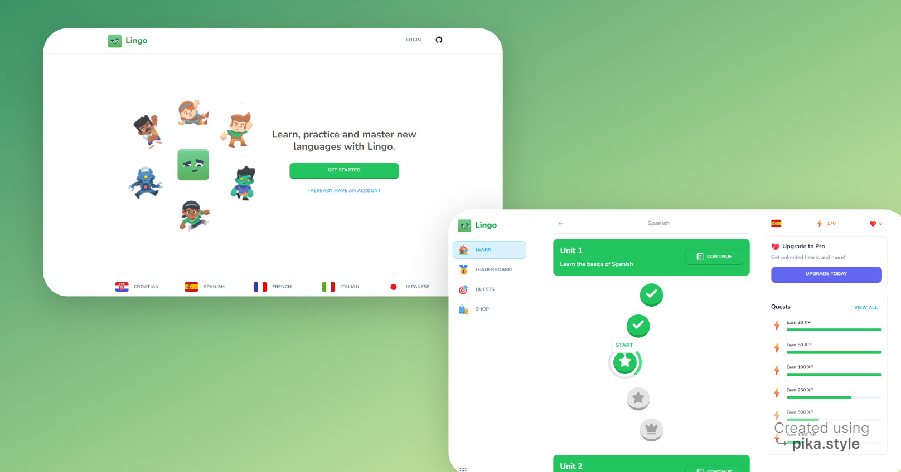
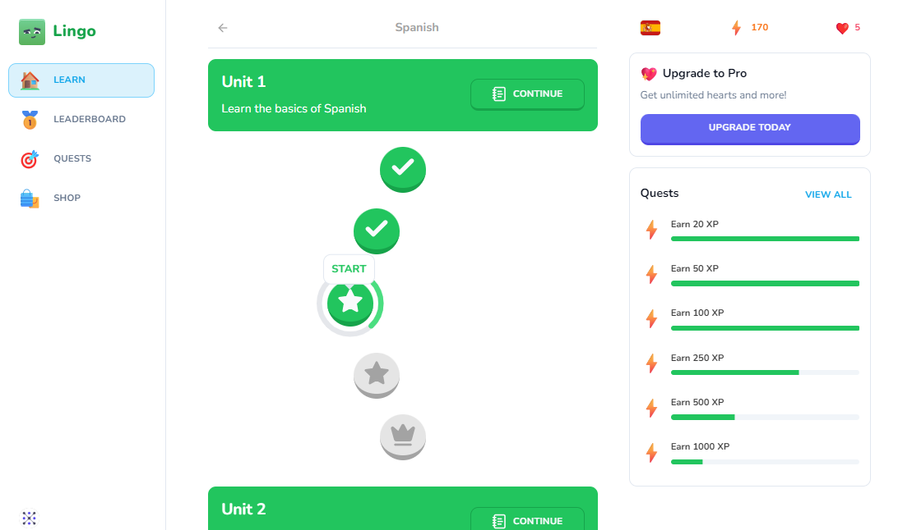
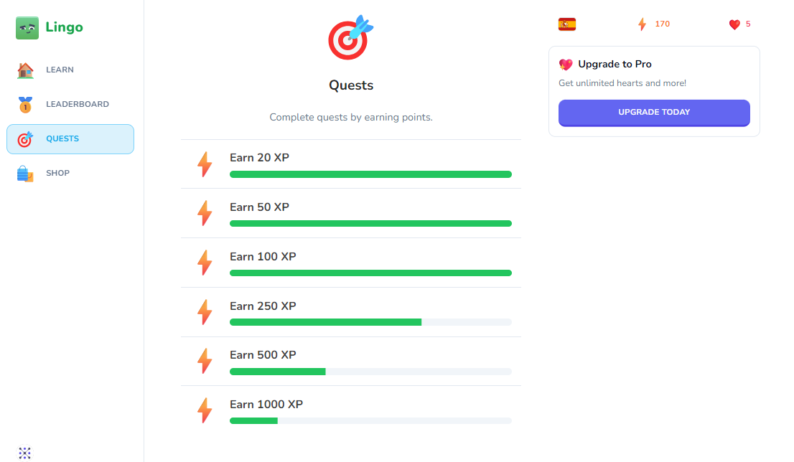
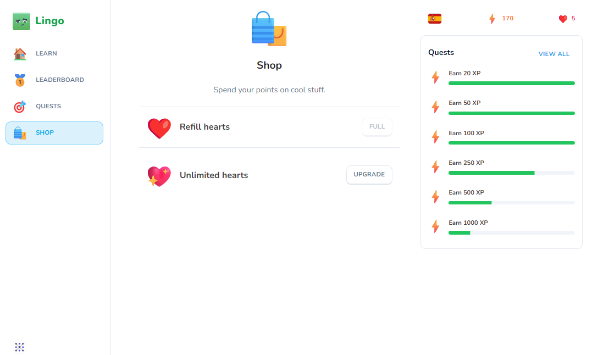
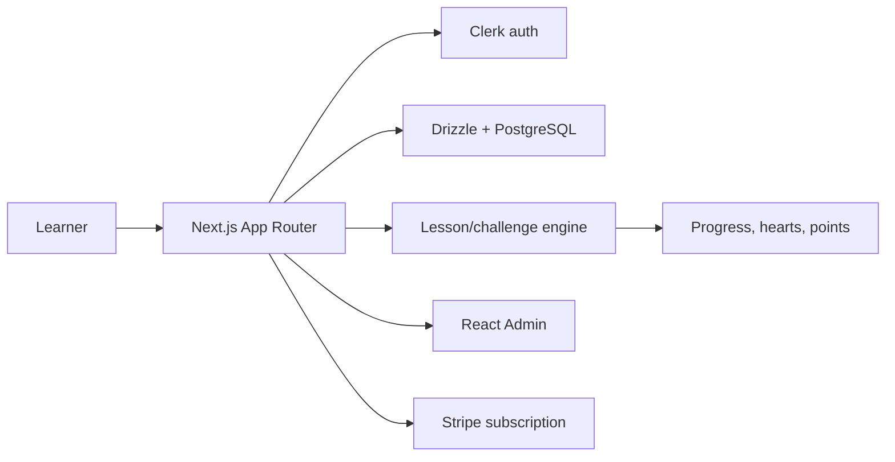

# Lingo

언어 학습 앱 구조를 바탕으로 한국어, 영어, 일본어, 스페인어, 이탈리아어, 한자, Python, Java 학습 코스를 함께 다루도록 확장 중인 Next.js 학습 플랫폼입니다. 아직 개발 중인 프로젝트라 데모 사이트 주소는 비워두고, 현재 구현된 기능과 화면 중심으로 정리했습니다.

Demo site:



## Current Status

- Next.js App Router 기반의 marketing, auth, main learning, lesson, admin route가 구성되어 있습니다.
- Clerk 인증, Drizzle ORM, Neon/PostgreSQL, Stripe subscription, React Admin 기반 운영 화면을 연결할 수 있는 구조입니다.
- 언어 코스뿐 아니라 Python/Java 프로그래밍 코스와 한자 코스를 추가하는 방향으로 확장하고 있습니다.
- 기존 clone/template README에 남아 있던 외부 author, 후원, Vercel demo, star-history 중심 내용을 제거하고 현재 포트폴리오 맥락에 맞게 정리했습니다.

## Screenshots

| Course selection | Quest progress |
| --- | --- |
|  |  |

| Shop and hearts |
| --- |
|  |

## Implemented Features

| Area | What is implemented |
| --- | --- |
| Marketing surface | Glass-field landing UI, animated hero visual, language panel, theme-aware global styling |
| Course catalog | Courses are grouped into language, hanja, and programming categories with custom visual themes |
| Learning path | Unit/lesson hierarchy, active lesson state, progress percentage, locked/completed lesson UI |
| Lesson engine | Challenge cards, quiz footer, result card, hearts modal, practice modal, exit modal |
| User progress | Hearts, points, active course, course progress, lesson percentage, subscription-aware state |
| Quests and shop | Quest checklist, heart refill, unlimited hearts promo, Stripe subscription hook |
| Admin tools | React Admin resources for courses, units, lessons, challenges, and challenge options |
| Localization | UI copy helper and locale cookie flow for Korean/English interface text |

## Course Direction

The project is moving beyond a single-language clone into a broader learning playground:

- Korean, English, Japanese, Spanish, Italian language courses
- Hanja memorization and meaning drills
- Python beginner drills based on control flow, functions, collections, and coding-test patterns
- Java beginner drills planned around syntax, objects, and problem-solving flow

## Architecture

```text
Lingo/
├── app/
│   ├── (marketing)/           # landing page
│   ├── (auth)/                # Clerk sign-in/sign-up
│   ├── (main)/                # courses, learn, quests, shop, leaderboard
│   ├── lesson/                # lesson and challenge player
│   ├── admin/                 # React Admin resources
│   └── api/                   # CRUD and Stripe webhook routes
├── actions/                   # server actions for progress/subscription
├── components/                # layout, progress, quest, promo, landing UI
├── db/                        # Drizzle schema, queries, connection
├── lib/                       # admin, course style, Stripe, locale, UI copy
├── scripts/course-data/       # language, hanja, and programming seed content
└── store/                     # modal state stores
```



## Environment

Create local env files from `.env.example`. Keep real credentials out of git.

```env
NEXT_TELEMETRY_DISABLED=1
NEXT_PUBLIC_CLERK_PUBLISHABLE_KEY=
CLERK_SECRET_KEY=
DATABASE_URL=
STRIPE_API_SECRET_KEY=
STRIPE_WEBHOOK_SECRET=
NEXT_PUBLIC_APP_URL=http://localhost:3000
CLERK_ADMIN_IDS=
```

## Run Locally

This repo uses `bun.lock`, so Bun is the preferred package manager.

```bash
bun install
bun run dev
```

Database setup when credentials are ready:

```bash
bun run db:push
bun run db:prod
```

## Validate

```bash
bun run lint
bun run build
```

If Clerk keys or database credentials are mismatched locally, authenticated pages can redirect before screenshots/build verification. In that case, fix env first and rerun the checks.
